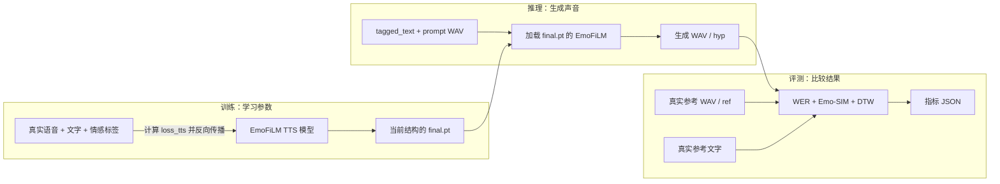
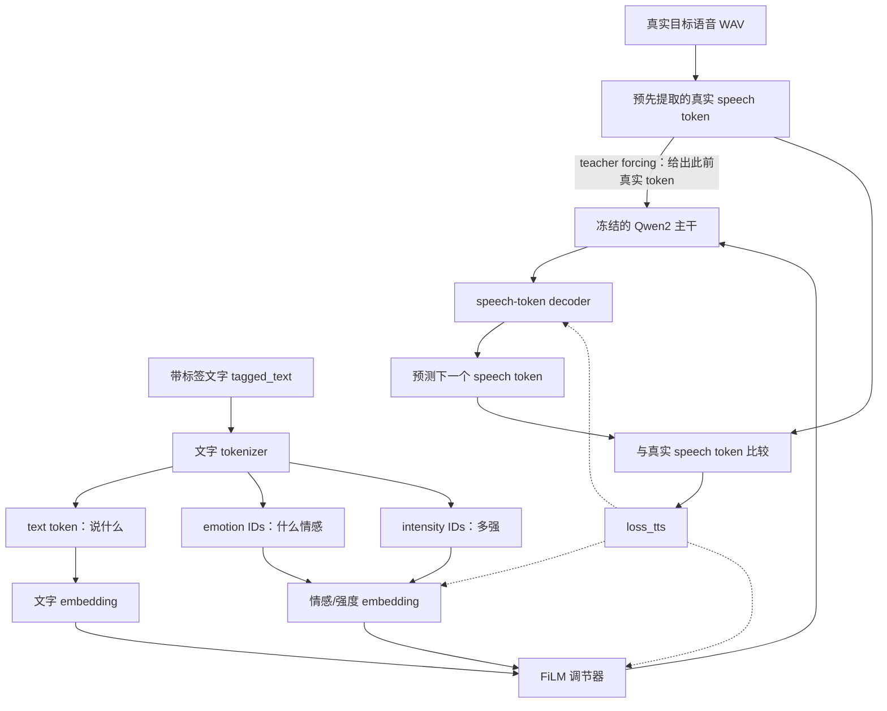
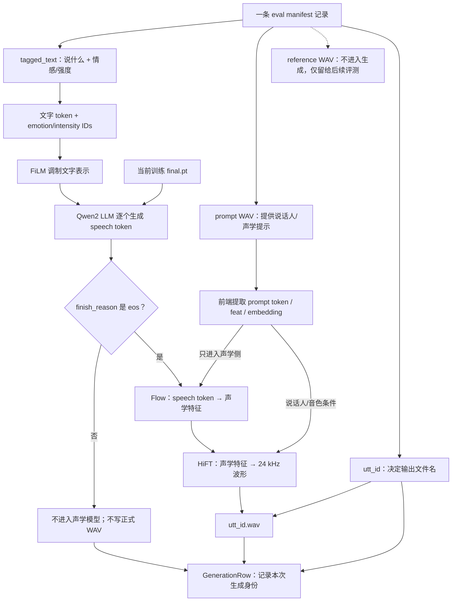
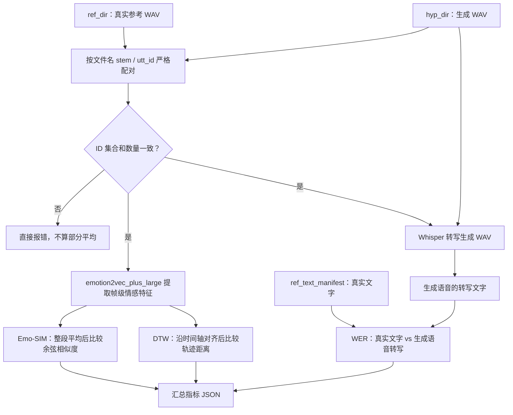
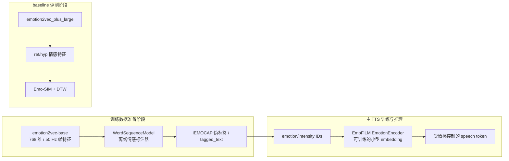

# EmoFiLM 当前代码真实训推评链路验证报告

日期：2026-07-29
代码版本：`ed89f48a23559034c84eba7ec709e7c67864eb64`
验证范围：当前 FiLM-only 训练 → 当前推理 → baseline `eval_emo_film` 评测
原则：只验证代码运行逻辑、数据真实性和方法是否按当前实验口径执行；不引入新评测、新监督或宏观方案。

## 1. 最终结论

当前代码的真实数据最小链路已经端到端跑通：

1. 从 v1 冻结训练 Parquet 取 8 条 train、4 条 CV 数据；
2. 使用当前 `train_emo.py`、当前模型结构和 CosyVoice2 `llm.pt` 完成 2 个 microbatch、1 次 optimizer step；
3. 训练产出的新 `final.pt` 被当前推理入口严格加载；
4. 推理真实生成 1 条 24 kHz 单声道 WAV，`finish_reason=eos`；
5. baseline `eval/eval_emo_film.py` 对该 WAV 完成 WER、Emo-SIM、DTW 计算并写出 JSON。

没有发现需要修改生产代码才能完成当前实验的阻塞，因此本次没有改训练、推理或评测代码，也没有加入任何额外设施。

正式实验启动前必须注意两项运行事实：

- 仓库现有 `exp/emofilm_v1/final.pt` 是旧 v1 模型结构，不能被当前推理代码加载；正式运行必须先用当前训练代码重新训练并使用新 checkpoint。
- `exp/emofilm_v1/eval_refs/{esd,fedd_a,fedd_b}` 当前为空或不存在。baseline 评测只扫描平铺 WAV 目录，不会自动读取 manifest 的 `reference_wav` 建链接；正式评测前必须重建引用视图。

## 2. 实际执行结果

### 2.1 最小训练

临时目录：`/tmp/emofilm-current-smoke-20260729/`

训练数据来自真实冻结 Parquet：

- train：首个正式 shard 的前 8 行；
- CV：首个正式 shard 的前 4 行；
- batch size：4；
- `accum_grad=2`；
- 共 2 个 train microbatch，恰好完成 1 次 optimizer step；
- smoke 仅把 `max_epoch` 改为 1、`warmup_steps` 改为 2、`log_interval` 改为 1，未改变模型、loss、冻结和 optimizer 分组方法。

关键运行证据：

| 项目                           |                                               实测结果 |
| ------------------------------ | -----------------------------------------------------: |
| 总参数量                       |                                            507,425,578 |
| 可训练参数量                   |                                     7,509,674（1.48%） |
| trainable tensors              |                                                     10 |
| FiLM 条件模块参数              |                                  1,616,384，LR`1e-4` |
| downstream heads 参数          |                                      5,382，LR`1e-4` |
| speech-token decoder 参数      |                                  5,887,908，LR`1e-5` |
| 第 1 个 microbatch`loss_tts` |                                               3.833059 |
| 第 2 个 microbatch`loss_tts` |                                               3.814432 |
| optimizer step 的 grad norm    |                                              23.101574 |
| CV`loss_tts`                 |                                               4.561883 |
| 输出 checkpoint                | `/tmp/emofilm-current-smoke-20260729/model/final.pt` |

新 checkpoint 的结构检查：

- 包含 `emotion_head.weight/bias`；
- 包含 `arousal_head.weight/bias`；
- 不包含旧的 `emotion_classifier.weight/bias`；
- 训练身份记录的合同哈希为 `6a67b685aea9bf4868c2ceb11a3c9c6ffea8dbb8925876cda582105e6296bdfe`；
- checkpoint SHA-256 为 `ea6f792299c5bb5c68967d4d2e3c5072827622676c239def4ef697c93ee6e887`。

### 2.2 最小推理

使用上述新 checkpoint 对 ESD manifest 第一条 `0011_000484` 执行真实推理。

结果：

- 当前严格 checkpoint loader 加载成功；
- `finish_reason=eos`；
- 成功落盘 WAV；
- 音频为 24 kHz、单声道、40,320 个采样点，约 1.68 秒；
- GenerationRow 包含 checkpoint、control/prompt 引用、decode config、seed、文本摘要、prompt 音频引用和 WAV 路径等当前字段；
- 写盘前合同校验通过。

### 2.3 最小 baseline 评测

只为 `0011_000484` 在 `/tmp` 建立一条同名参考音频链接，未批量修改正式 `eval_refs`。

baseline 输出：

```json
{
  "metric_contract_version": "emofilm-eval-v2",
  "emo_sim": 48.92981891864356,
  "dtw": 63.311236633317634,
  "dtw_normalized": 0.510574488978368,
  "dtw_euclidean": 1666.503728751356,
  "dtw_euclidean_normalized": 13.43954619960771,
  "wer": 0.3333333333333333,
  "n_samples": 1,
  "wer_percent": 33.33333333333333
}
```

这些单样本数值只用于证明代码链路闭合，不能代表正式模型效果。字段中的历史名称 `emofilm-eval-v2` 是 baseline 文件现有输出标签，本次未修改，也不影响指标计算方法。

第一次评测尝试在指标计算后因输出 JSON 的父目录不存在而失败；创建临时父目录后，完全相同的评测命令成功。正式留档目录当前存在，因此这只是 CLI 前置条件，不是训练或评测方法阻塞。

## 3. 训练逻辑与方法正确性

### 3.1 情感控制确实进入模型

真实训练 Parquet 的文本含 `<emotion type=... intensity=...>` 标签。数据链依次执行：

`data.list → Parquet 行 → tokenize_emo → text_token/emotion_ids/intensity_ids → padding batch → Qwen2LM_Emotion.forward`

模型中：

1. `emotion_ids` 和 `intensity_ids` 分别查 embedding；
2. 两个 embedding 相加成为每个文本 token 的情感条件；
3. FiLM adapter 产生缩放量和偏移量；
4. 文本表示执行 `gamma * text_embedding + beta`；
5. 调制后的文本表示进入语音 token 预测；
6. speech-token 交叉熵 `loss_tts` 反向传播到 FiLM 条件模块。

因此当前 FiLM-only 训练不是“标签只写在文本里但模型没用”，情感与强度条件实际参与了前向和反向传播。

### 3.2 loss 与当前实验口径一致

当前 `downstream_supervision: disabled`。训练 pipeline 不提供 span 监督时，模型显式返回：

`loss = loss_tts`gw

这与本次“只靠 FiLM 条件做情感可控 TTS，不训练额外情感监督头”的口径一致。代码不是静默忽略配置，而是由显式开关决定分支。

### 3.3 冻结与训练范围

冻结：

- Qwen2 LLM 主干；
- speech embedding；
- LLM embedding。

参与 optimizer：

- `emotion_encoder`：学习 emotion/intensity 的向量表示；
- `emotion_adapter`：把条件变成 FiLM 的缩放和偏移；
- `llm_decoder`：把隐藏表示映射为 speech token；
- `emotion_head`、`arousal_head`：模块仍在 optimizer 中，但在 `downstream_supervision=disabled` 且无 span 时没有 loss、没有梯度，不影响本次 FiLM-only 更新。

这次 smoke 的日志确认真正发生更新的是有梯度的 FiLM 与 decoder 路径；第二个 microbatch 后 grad norm 非零并执行 optimizer step。

### 3.4 正式配置是否被代码真正消费

当前正式配置中的以下参数都有实际运行路径：

- `max_epoch=5`：直接控制 epoch 循环；
- batch size 4：由静态 batch processor 消费；
- `accum_grad=2`：loss 除以 2，每两个 microbatch 执行一次 optimizer step；
- LR `1e-4 / 1e-4 / 1e-5`：分别用于 FiLM、新 heads、预训练 decoder；
- `warmup_steps=250`：由 `WarmupLR` 消费并随 optimizer step 推进；
- `grad_clip=5`：进入训练执行器。

本报告只确认这些参数“按代码预期生效”，不对经验最优值做额外判断。

### 3.5 seed

正式默认运行的实际 RNG seed 是 YAML 中的 1986，Python、NumPy、PyTorch 和 CUDA 都会设置；CLI 默认 `--seed=1986` 与它一致，因此当前正式命令可复现。

非阻塞注意：CLI 传入非 1986 时只会改变 identity 中记录的 seed，不会覆盖 YAML 已执行的 RNG seed。当前实验应保持默认 1986；本次不为未使用的自定义 seed 场景扩展代码。

## 4. 数据真实性检查

### 4.1 训练数据

- train manifest：20,774 行；
- CV manifest：1,092 行；
- train Parquet：21 个 shard；
- CV Parquet：2 个 shard；
- Parquet metadata 行数与 manifest 完全一致；
- 抽样行含真实音频、非空 speech token、192 维 embedding 和带情感标签文本；
- train/cv 的 emotion 仅为 `ang/hap/neu/sad/sur`，intensity 仅为 `low/medium/high`；
- 未发现 stub、占位标签、全零哈希或空数据进入 v1 冻结 manifest。

### 4.2 标签来源

- ESD：数据集句级 emotion 生成整句 fixed-medium 标签；
- FEDD：由构造时已知的情感转换生成；Part B 使用精确拼接边界，Part A 使用已明确记录的中点近似；
- IEMOCAP：使用冻结的作者 WordSequence 伪标签结果，并有 checkpoint/hash 与抽样回放记录。

### 4.3 生成数据

当前三个 eval manifest 共 2,500 行，引用的待合成文本、prompt WAV、reference WAV 均存在。推理调用真实模型；只有 `finish_reason=eos` 才进入 Flow/HiFT 并写 WAV，非 EOS 会清除可能残留的同名旧 WAV。

现有 full 目录的 WAV 数量为 ESD 1,500、FEDD-A 500、FEDD-B 500，文件 stem 与各自 manifest 的 `utt_id` 集合一致。它们是旧 v1 checkpoint 的历史产物，不应作为“当前代码新 checkpoint 已完成正式生成”的证据；本次只使用新 checkpoint 生成的 `/tmp` 样本证明当前链路。

### 4.4 历史身份不闭合，但不阻塞 fresh 实验

当前合同重算哈希为 `6a67b685...bdfe`，历史 v1 训练/生成/评测 identity 记录的是 `b5aab142...a3e9d`；同时 provenance 中四个 FEDD 文件的记录哈希与当前文件不一致。

这意味着不能声称“当前合同逐字节等同于历史 v1 运行输入”。但当前 fresh 训练会把当前合同哈希写入新 identity，当前 manifest 和 Parquet 本身可真实读取并完成训练，因此它不阻塞本次新的 13→14→baseline 实验。为避免扩面，本次不改历史 provenance。

## 5. 模块衔接检查

### 5.1 checkpoint

旧 `exp/emofilm_v1/final.pt`：

- 含旧 `emotion_classifier`；
- 缺当前 `emotion_head/arousal_head`；
- 当前严格 loader 正确拒绝加载。

新训练 checkpoint：

- 保存当前完整模型 state；
- 推理过滤 `epoch/step` 元数据后 strict load；
- 本次真实加载成功。

不应放宽 loader 去兼容旧 checkpoint，因为随机补新模块会把旧产物伪装成当前训练产物。

### 5.2 WAV 与评测配对

推理写出 `{output_dir}/{utt_id}.wav`。baseline 评测分别扫描 ref/hyp 目录，以文件 stem 作为 ID，并要求集合完全相等；本次 `0011_000484.wav` 成功配对。

GenerationRow 的额外身份字段不会与 baseline 冲突，因为 baseline 不读取生成 JSONL，只读取 WAV 目录和可选的参考文本 manifest。

### 5.3 eval_refs

正式评测前需要按每个 eval manifest 的：

- `utt_id`：决定链接文件名 `{utt_id}.wav`；
- `reference_wav`：决定链接目标；

重建平铺引用视图。当前未批量创建，避免在未确认的情况下进行大量文件系统操作；本次单样本链接已证明这种衔接方式可用。

## 6. 全量测试

本次从当前工作树重新执行：

```bash
conda run -n emofilm env PYTHONPATH=.:third_party/Matcha-TTS python -m pytest -q
```

结果：

- `475 passed`；
- `2 failed`；
- `11 warnings`；
- 用时 255.39 秒。

两个失败与交接记录一致：

1. `tests/test_eval_smoke.py` 依赖预先存在的 `/tmp/smoke_zh.wav` 和 `/tmp/smoke_en.wav`，当前不存在，所以测试自己创建的 ref/hyp 为空；本次已经用真实生成 WAV 单独跑通 baseline。
2. `tests/test_extract_emotion2vec_frame.py` 要求显式设置 `EMOFILM_PROJECT_ROOT` 和 `EMOFILM_UPSTREAM`，当前缺少经过验证的 fairseq upstream 路径。

针对训推数据合同的聚焦测试另行执行，结果为 `58 passed`。

## 7. 目前训练、推理、评测三大模块的通俗解析

### 7.0 先看全局：三个模块怎样接起来

先把整个项目看成一条生产线：训练负责学会“怎样按文字和情感要求预测语音”，推理负责真的合成 WAV，评测负责把合成 WAV 与真实参考进行比较。



最重要的边界是：

- 训练输出的是 checkpoint，不是最终指标；
- 推理输出的是合成 WAV 和生成记录；
- 评测只比较 ref/hyp WAV 和参考文字，不读取训练 loss，也不读取 GenerationRow 来算指标。

### 7.1 训练：模型到底吃什么、学什么

每条训练数据可以简单理解为四样东西：

1. 一段真实语音；
2. 这段语音说了什么文字；
3. 文字上标出的情感和强度，例如“这句话是愤怒、中等强度”；
4. 从真实语音提前提取好的 speech token 和说话人相关向量。

训练的主数据流如下。图中实线表示前向计算，虚线表示 loss 反向更新参数。



可以把三种编号理解为三张完全不同的“纸条”：

```text
text token       ：纸条上写“要说哪些字”
emotion ID       ：纸条上写“用开心、悲伤、愤怒……哪种情感”
intensity ID     ：纸条上写“情感用 low / medium / high 哪一档”
speech token     ：正确答案纸条，表示目标语音的离散声音单位
```

训练时，文字先被切成模型能处理的小单位。情感标签也被展开到对应文字位置，形成两列与文字对齐的编号：一列表示 happy/sad/angry 等情感，另一列表示 low/medium/high 强度。

FiLM 可以通俗地理解为“根据情感要求调一组旋钮”。它不重写文字，而是对每个文字位置的内部表示做两件事：乘一个缩放值，再加一个偏移值。这样，相同文字在“开心”和“悲伤”条件下会形成不同的内部表示。

调制后的文字表示交给语音语言模型。训练答案不是直接的 WAV，而是目标语音提前转换出的 speech token。模型一步步预测下一个 speech token，并与真实 token 比较。预测错误越多，`loss_tts` 越大；反向传播根据这个误差更新 FiLM 和 speech-token decoder。

本次训练不使用额外情感分类 loss，也不使用 arousal loss。两个监督头虽然仍是模型成员，但当前分支没有给它们计算 loss，所以它们没有梯度。这不会把随机头的结果混入 TTS loss。

当前训练的“冻结/训练”边界可以直接看成：

```text
┌────────────────────────────────────────────────────────────┐
│ 冻结：保留基础 TTS 能力                                    │
│  Qwen2 主干 + text embedding + speech embedding            │
└────────────────────────────────────────────────────────────┘
                         │ 产生隐藏表示
                         ▼
┌────────────────────────────────────────────────────────────┐
│ 会训练：适配当前情感控制                                   │
│  emotion/intensity embedding + FiLM + speech-token decoder │
└────────────────────────────────────────────────────────────┘

emotion_head / arousal_head：
  模块存在，也被放进 optimizer；但本次没有对应 loss，因此没有梯度、不会更新。
```

模型并不是全部重新训练。体量最大的 Qwen2 主干、文字 embedding 和 speech embedding 都冻结，保持预训练能力；真正训练的是情感/强度 embedding、FiLM 调节器以及最后的 speech-token decoder。这样做的直接含义是：保留基础 TTS 能力，同时让较小的条件模块学习“情感要求怎样影响语音 token 预测”。

batch size 4 表示每个 microbatch 放 4 条数据；`accum_grad=2` 表示连续看两批、累计两批的梯度后才更新一次权重，所以一次更新实际使用 8 条数据。正式训练跑 5 个 epoch，也就是让模型按数据加载器的顺序完整看 5 轮训练集。

一次权重更新的实际节奏是：

```text
microbatch 1：4 条数据 → 算 loss → 保存梯度 ─┐
                                              ├→ 合并梯度 → clip → optimizer.step
microbatch 2：4 条数据 → 算 loss → 累加梯度 ─┘

所以：batch_size=4、accum_grad=2 → 每次参数更新实际汇总 8 条数据。
```

### 7.2 推理：文字怎样变成 WAV

推理输入是一条 eval manifest 记录，主要包含：

- `utt_id`：输出文件名；
- `tagged_text`：要说的文字以及情感/强度控制；
- `prompt_wav`：提供说话人和声学条件；
- `reference_wav`：仅供后续评测使用，不进入本次生成；
- 当前训练 checkpoint；
- seed 和 decode config。

推理数据流如下：



这里特别注意：当前 target-only 单流协议中，`prompt_text`、prompt 的情感标签和 prompt speech token 不进入 LLM 的文字/情感控制前缀。真正决定“说什么、用什么情感”的是目标 `tagged_text`；`prompt_wav` 的有效作用在 Flow/HiFT 声学侧，主要提供说话人和声音条件。

第一步与训练相同：文字和情感标签变成 token 与情感/强度编号，经过同一个 FiLM 调制。区别是训练时模型看得到正确的后续 speech token，推理时看不到，只能从起始标记开始自己逐个生成 speech token，直到生成 EOS 或触发长度/错误终止条件。

只有正常生成 EOS 的结果才继续变成声音。生成出的 speech token 先进入 Flow，转换为类似声谱图的声学特征；再进入 HiFT 声码器，转换为可播放的 24 kHz 波形。最终保存为 `{utt_id}.wav`。

如果没有正常结束，代码不会写正式 WAV，并会删除可能存在的同名旧 WAV，防止评测误把旧声音当成本次结果。生成后还会写一行 JSON，记录本次到底用了哪个 checkpoint、哪条控制数据、哪条 prompt、什么 seed 和 decode 参数，便于判断旧文件能否安全复用。

`finish_reason` 可以看成生成流水线的闸门：

```text
eos                           → 完整结束 → 可以进入 Flow/HiFT → 可以写 WAV
max_len_reached               → 达到长度上限 → 不写 WAV
invalid_token_retry_exhausted → 非法 token 重试耗尽 → 不写 WAV
sampler_error                 → 采样错误 → 不写 WAV
input_rejected                → 输入长度合同不成立 → 不写 WAV
```

### 7.3 评测：输入输出是什么，三个指标在看什么

baseline 评测不读取训练日志，也不读取 GenerationRow。它只需要：

1. `ref_dir`：真实参考 WAV，文件名必须是 `{utt_id}.wav`；
2. `hyp_dir`：模型生成 WAV，文件名也必须是 `{utt_id}.wav`；
3. `ref_text_manifest`：每个 `utt_id` 的真实文字；
4. 可选的 `expected_count`：预期样本数量。

baseline 评测内部其实分成两条并行支路：一条检查“说得对不对”，另一条检查“情感声音像不像”。



评测先检查两个目录的文件名集合是否完全一致，少一个或多一个都会报错。配对后计算三类结果：

- WER：先把生成语音转成文字，再与 manifest 的真实文字比较。数字越低，表示说错、漏说或多说的词越少。
- Emo-SIM：把参考语音和生成语音各自转换成表示整体情感的向量，再看两个向量有多相似。数字越高，表示整段情感整体更接近。
- DTW：比较参考语音与生成语音随时间变化的情感特征。它允许两段语音说话快慢不同，再寻找较合理的时间对齐。距离越低，表示变化轨迹更接近。

三个指标不能互相替代：

```text
WER      回答：内容说对了吗？                         越低越好
Emo-SIM  回答：整段语音的总体情感方向相似吗？         越高越好
DTW      回答：随时间变化的情感特征轨迹接近吗？       越低越好

例子：
  文字完全正确但语气很平 → WER 可能很好，Emo-SIM/DTW 可能较差。
  情感很像但漏说几个词   → Emo-SIM 可能很好，WER 可能较差。
```

最终输出一个 JSON，包含整体平均指标和样本数。当前 baseline 是整句整体评测；本次没有加入词级裁判、外部模型或新的监督逻辑。

### 7.4 最容易混淆的概念与模型

#### 7.4.1 三个名字里都有“emotion”，但不是同一个东西



| 名称                       | 在什么时候使用                        | 输入                       | 输出                                    | 是否参与当前 TTS 反向传播 |
| -------------------------- | ------------------------------------- | -------------------------- | --------------------------------------- | ------------------------- |
| `emotion2vec-base`       | IEMOCAP 数据准备/历史词级标注链       | 真实音频                   | 768 维、50 Hz 帧特征                    | 否，离线预处理工具        |
| `WordSequenceModel`      | 接在`emotion2vec-base` 后做离线标注 | 768 维帧特征               | 情感类别和 VAD/强度相关结果，形成伪标签 | 否，主 TTS 训练前已完成   |
| EmoFiLM`EmotionEncoder`  | 主 TTS 训练与推理                     | 离散 emotion/intensity IDs | 供 FiLM 使用的条件 embedding            | 是，它是当前可训练模块    |
| `emotion2vec_plus_large` | baseline 评测                         | ref/hyp WAV                | 评测用情感特征                          | 否，只负责算 Emo-SIM/DTW  |

一句话区分：`emotion2vec-base + WordSequenceModel` 是“准备训练标签的人”，EmoFiLM `EmotionEncoder` 是“真正控制 TTS 的旋钮”，`emotion2vec_plus_large` 是“考试时打分的人”。三者权重不共享，也不在同一次前向里串联。

另外，数据中的 `emo2vec_label` 只能作为来源 metadata，不能直接混进 `tagged_text` 控制文本。控制文本使用经过合同确定的 emotion/intensity 标签，而不是在推理时临时调用 emotion2vec 猜一个标签。

#### 7.4.2 `tagged_text`、`prompt_wav`、`reference_wav`

| 字段              | 通俗含义                         | 训练/推理时做什么                                        | 评测时做什么                                            |
| ----------------- | -------------------------------- | -------------------------------------------------------- | ------------------------------------------------------- |
| `tagged_text`   | “要说什么，以及要求什么情感”   | 进入 tokenizer、EmotionEncoder 和 FiLM，是主要控制输入   | 不直接用于音频情感指标；其中的纯文字可作为 WER 参考来源 |
| `prompt_wav`    | “希望声音像谁、声学条件是什么” | 进入 Flow/HiFT 声学侧；当前不把 prompt 情感当作 LLM 控制 | 不作为该样本的正确答案                                  |
| `reference_wav` | “这道题对应的真实正确语音”     | 不进入本次生成模型，避免把答案喂给模型                   | 放入`ref_dir`，与生成 WAV 计算 Emo-SIM/DTW            |

最容易犯的错误是把 prompt WAV 和 reference WAV 当成同一种“参考音频”。它们的职责不同：prompt 是生成条件，reference 是评测答案。

#### 7.4.3 text token、speech token、声学特征、WAV

```text
文字
  │ tokenizer
  ▼
text token                 模型理解“说什么”的离散编号
  │ Qwen2 + EmoFiLM
  ▼
speech token               模型生成“声音内容”的离散编号，仍不能直接播放
  │ Flow
  ▼
声学特征 / 类似 mel 表示   连续数值，描述声音随时间的频谱形状
  │ HiFT
  ▼
WAV                        最终可播放的 24 kHz 波形
```

`speech token` 不是文本 token，也不是 WAV。训练的 `loss_tts` 比较的是预测 speech token 与真实 speech token；不是直接逐采样点比较 WAV。

#### 7.4.4 训练 loss 与评测指标

| 名称                      | 在哪里计算                | 参与反向传播吗 | 主要含义                            |
| ------------------------- | ------------------------- | -------------: | ----------------------------------- |
| `loss_tts`              | 训练                      |             是 | speech-token 预测错误程度           |
| emotion/arousal head loss | 当前 FiLM-only 分支不计算 |         当前否 | 预留的下游 span 监督；本次 disabled |
| WER                       | 评测                      |             否 | 合成语音内容是否说对                |
| Emo-SIM                   | 评测                      |             否 | 合成与参考的整段情感方向是否相似    |
| DTW                       | 评测                      |             否 | 情感特征随时间变化的轨迹是否接近    |

训练 loss 下降不能直接推出 WER、Emo-SIM、DTW 一定改善；它只说明模型更会预测训练目标 speech token。最终效果仍需生成 WAV 后用 baseline 指标检查。

#### 7.4.5 intensity 与 arousal

- `intensity`：输入侧的离散控制档位，当前是 `low / medium / high`，会进入 EmoFiLM `EmotionEncoder`。
- `arousal`：下游监督设计里的连续数值，表示情绪激活程度，由 `arousal_head` 回归。
- 当前实验 `downstream_supervision=disabled`，因此 intensity 仍然控制 FiLM，但 arousal head 不计算 loss。

二者相关但不等价：不能把 `high intensity` 简单当成某个固定 arousal 数值，也不能因为 arousal head 未训练就认为 intensity 控制没有进入模型。

#### 7.4.6 三种 checkpoint/模型资产

| 资产                                           | 内容                                          | 本项目怎样使用                                               |
| ---------------------------------------------- | --------------------------------------------- | ------------------------------------------------------------ |
| `pretrained_models/CosyVoice2-0.5B/llm.pt`   | CosyVoice2 基础语音 LLM 权重                  | 当前训练的初始化起点，允许缺少新 FiLM/heads 参数             |
| 当前训练产生的`final.pt`                     | 基础权重加当前 EmoFiLM 模块、decoder 训练结果 | `inference_emo_film.py --llm_ckpt` 必须加载它              |
| `model_dir` 下的 `flow.pt`、`hift.pt` 等 | speech token 到声学特征、再到 WAV 的模型      | 推理时与新`final.pt` 一起工作，但它们不是同一个 checkpoint |

旧 `exp/emofilm_v1/final.pt` 属于旧结构，包含 `emotion_classifier` 而不含当前 heads，所以不能拿它冒充当前训练产物。

#### 7.4.7 eval manifest、GenerationRow、run identity

| 文件/记录                 | 什么时候产生       | 作用                                                          |
| ------------------------- | ------------------ | ------------------------------------------------------------- |
| eval manifest             | 生成前已经存在     | 定义要合成的`utt_id`、文字、控制标签、prompt 和 reference   |
| GenerationRow             | 每条推理结束后产生 | 记录这条是否 EOS、用了哪个 checkpoint/seed/config、WAV 在哪里 |
| train/generation identity | 一次运行级别       | 记录整次运行的代码版本、合同哈希、命令和 checkpoint 身份      |
| baseline metrics JSON     | 评测完成后产生     | 保存 WER、Emo-SIM、DTW 的汇总结果                             |

baseline 评测不会从 GenerationRow 读取 WAV 身份字段来配对；它按 ref/hyp 目录中的 WAV 文件名严格配对。因此 GenerationRow “记录正确”与 WAV 目录“配对完整”是两道不同检查。

#### 7.4.8 句级标签、词级标签与当前 baseline

- ESD 控制标签是整句级：一句话整体使用一个情感标签。
- FEDD 数据可以在一句话内部存在情感转折标签。
- 当前 FiLM 可以接收随文字位置变化的 emotion/intensity IDs。
- 但当前 baseline 的 Emo-SIM 是整段聚合，WER 是整句内容指标；DTW 虽保留时间序列比较，也不是独立的词级情感裁判。

因此，“输入支持局部变化”与“当前评测能精确判断每个词是否按标签变化”不是同一件事。本项目当前只使用既定 baseline，不在本报告中扩展新的局部评测。

## 8. 本次未做事项

- 未修改训练、推理、评测生产代码；
- 未重建完整 2,500 条 `eval_refs` 链接；
- 未启动 5 epoch 正式训练；
- 未执行 2,500 条正式生成与三分区完整评测；
- 未修订历史 provenance/identity；
- 未引入 v2 局部评测、外部裁判或额外监督。

这些都不影响本报告的结论：当前代码在真实数据最小规模上已经完成训练、生成和 baseline 评测的闭环；正式实验需要使用当前代码重新训练的新 checkpoint，并在评测前准备好平铺引用 WAV 视图。

## 9. 工程原则落实

- KISS：只使用 8/4 条真实数据、1 次权重更新、1 条生成和 1 条评测确认链路。
- YAGNI：没有添加新指标、新监督、新兼容层或自动化设施。
- DRY：复用正式训练、推理和 baseline 评测入口，没有另造平行实现。
- SOLID：本次没有为验证目的改变模块职责；分别通过训练输出、推理输出和评测输入边界验证衔接。
